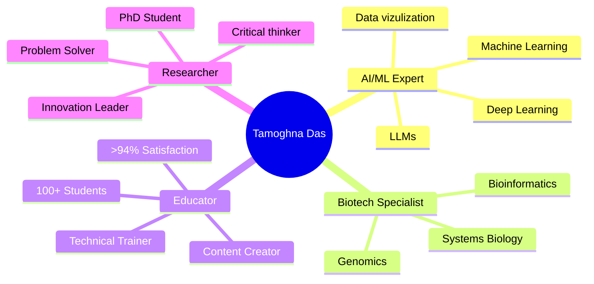

# Hi there! I'm Tamoghna Das 👋

<div align="center">
  
</div>

<div align="center">
  
  
  
</div>

---

## 🚀 About Me

<div align="center">
  
| 🎯 **Current Role** | 🎓 **Education** | 🌍 **Location** | 📈 **Impact** |
|:---:|:---:|:---:|:---:|
| Researcher (PhD) | PhD (ongoing) @ Loughborough University | England, UK 🇬🇧 | 100+ Students Trained |

</div>

### 🔬 Research & Innovation Journey

<table>
<tr>
<td width="50%">

**🧬 Biological AI Systems**
```yaml
research_focus:
  - genome_scale_modeling: "Optimization & Visualization"
  - healthcare_ai: "Clinical Decision Support"
  - systems_biology: "Boolean Cancer Models"
  - drug_discovery: "ML for Molecular Properties"
```

**📚 Education & Training**
- 🏆 **100+ Learners** trained with >94% satisfaction
- 🌟 **Co-Founder** @ Artificial Intelligence Update  
- 🎯 **Technical Trainer** in Data Analytics
- 📖 **Content Creator** for AI/ML education

</td>
<td width="50%">

**🎓 Academic Background**
```sql
SELECT institution, degree, field 
FROM education 
WHERE tamoghna_id = 'current'
ORDER BY year DESC;

-- PhD | Chemical Engineering | Loughborough (UK)
-- MSc | Biochemical Engineering | UCL (UK) 
-- MSc | Data Science | UEA (UK)
-- BTech | Biotechnology | VIT (India)
```

**🏆 Achievements**
- 🥇 Bio-Inspired Design Winner (India)
- 🏅 Chem-a-Thon Champion 
- 🌍 ICID Hackathon (Buenos Aires)
- 🧪 Ginkgo Bioworks Challenge

</td>
</tr>
</table>

### 💡 What Sets Me Apart

<div align="center">



</div>

**🧪➡️📊 My Superpower**: *Translating complex biological phenomena into actionable data insights through cutting-edge AI/ML techniques*

---

## 🎯 Current Focus

<table>
<tr>
<td width="50%">

### 🔬 Research & Innovation
- **PhD Research**: AI applications in chemical/biological systems with bioinformatics focus
- **Pipeline Development**: Reproducible bioinformatics workflows with bash and python
- **Model Development**: ML for genomics and metabolomics
- **Systems Biology**: Boolean models for cancer cell behavior

</td>
<td width="50%">

### 📚 Education & Training  
- **Co-Founder**: Artificial Intelligence Update
- **Technical Trainer**: Data Analytics curriculum design
- **Content Creator**: AI/ML educational resources
- **Mentorship**: 100+ students in data science transition

</td>
</tr>
</table>

---

## 🛠️ Tech Arsenal

<div align="center">

### 🐍 Programming Languages


### 🧠 AI/ML & Data Science


### 🧬 Bioinformatics & Research Tools


### ☁️ Cloud & DevOps


### 🗄️ Databases


</div>

---

## 📊 GitHub Analytics

<div align="center">
  
  
</div>

<div align="center">
  
</div>

<div align="center">
  
</div>

---

## 🏆 Achievements & Recognition

<div align="center">
  
</div>

### 🌟 Notable Accomplishments
- 🎓 **UKRI & Industry collab PhD Scholarship** - Loughborough University
- 👨‍🏫 **100+ Students Trained** - Data Science & AI (>94% satisfaction rate)
- 🏆 **Bio-Inspired Design Winner** - Summer fest'16, India
- 🧬 **Chem-a-Thon Winner** - Chemical Hackathon, India
- 🌍 **International Recognition** - ICID Hackathon Buenos Aires 2018
- 🧪 **Ginkgo Bioworks Challenge** - Synthetic Biology Competition

---

## 🔥 Featured Projects

<div align="center">

[](https://github.com/Tamoghna12/obsidian-ai-assistant)


</div>

### 🚀 Project Highlights

| Project | Description | Technologies | Impact |
|---------|-------------|-------------|---------|
| 🧬 **bench2bash-starter** | Reproducible bioinformatics pipeline template | Snakemake, Docker, Conda | Foundation for research automation |
| 🤖 **AI for Drug Discovery** | ML models for molecular property prediction | Python, TensorFlow, RDKit | Accelerating pharmaceutical research |
| 📊 **Genomics Data Pipeline** | Scalable WGS analysis workflow | Galaxy, Nextflow, Python | Processing TB-scale genomic data |
| 🏥 **Healthcare Analytics** | ML for clinical decision support | Python, Scikit-learn, Flask | Improving patient outcomes |

---

## 📈 Contribution Heatmap

<div align="center">
  


</div>

---

## 🎯 What I'm Up To

- 🔭 **Currently working on**: AI-driven biological system optimization for my PhD
- 🌱 **Learning**: Advanced deep learning for protein structure prediction and Machine learning in computational biology
- 👯 **Collaborating on**: Open-source bioinformatics tools and educational content on AI in bioinformatics 
- 🤔 **Looking for help with**: Scaling ML models for healthcare applications, food and nutrition
- 💬 **Ask me about**: AI/ML, Bioinformatics, Data Science, Python, Research methodology, content development and teaching
- 📫 **Reach me at**: tamoghnadas.12@outlook.com
- ⚡ **Fun fact**: I've taught students from 120+ countries and can debug both Python code and biological pathways! 🧬🐍

---

## 🌐 Let's Connect!

<div align="center">

[](https://www.linkedin.com/in/tamoghnadas12)
[](mailto:tamoghnadas.12@gmail.com)
[](https://github.com/Tamoghna12)
[](https://tamoghna12.github.io/bench2bash.github.io)

</div>

---

## 📚 Recent Blog Posts & Publications

<!-- BLOG-POST-LIST:START -->
- 🧬 **AI-Driven Approaches in Systems Biology**: Bridging computational models with experimental data
- 🤖 **Machine Learning for Genomics**: From sequence analysis to functional prediction  
- 📊 **Data Science Education**: Effective strategies for teaching complex concepts
- 🔬 **Reproducible Research Pipelines**: Best practices for bioinformatics workflows
<!-- BLOG-POST-LIST:END -->

---

<div align="center">

### 💭 *"Science is not only a disciple of reason but also one of romance and passion."* - Stephen Hawking

**Thanks for visiting! Feel free to explore my repositories and don't hesitate to reach out for collaborations! 🚀**


</div>
